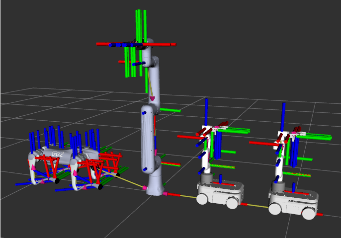

# Multi-Robot Visualization in ROS 2 Humble

This repository provides a collection of URDF models, mesh assets, and launch files to visualize multiple robot types in RViz2 under ROS 2 Humble. It includes support for GO2, MYAGV, MyCobot 280 Pi (with camera, pump, and gripper), Nova5 with Robotiq 2F85 gripper, and combination robots.

## 📦 Included Robots

- **GO2 Quadruped**
- **MYAGV Base**
- **MyCobot 280 Pi** with camera flange and pump
- **Nova5 Arm** with Robotiq 2F85 gripper
- **Combo Models** combining myagv and mycobot_280_pi with gripper

## 🚀 Quick Start
### 1. **Clone the Repository**

```bash
git clone https://github.com/YOUR_USERNAME/All_Robot.git
```

Copy robot_description under your ros 2 humble workspace, here is an example:
```bash
cp robot_description/ ~/ros2_ws/src
cd ~/ros2_ws
colcon build
```
do not forget to source the setup file after compilation
```bash
source install/setup.bash
ros2 launch robot_description all_in_one.launch.py
```

### 2. Launch Individual Robots
You can also launch individual models:
```bash
ros2 launch robot_description/go2.launch.py
ros2 launch robot_description/myagv.launch.py
ros2 launch robot_description/nova5.launch.py
ros2 launch robot_description/mycomb.launch.py
```

### 3. Expected output in RViz2
 

## Dependencies
### Make sure you have the following ROS 2 Humble packages installed:
```bash
sudo apt install ros-humble-xacro ros-humble-rviz2 ros-humble-tf2-ros
```

## 🙏 Acknowledgements

The robot models and mesh files included in this repository are sourced or adapted from publicly available resources and vendor documentation, listed below per robot:

### 🐾 GO2 Quadruped

- **Mesh Source:** [Unitree Robotics](https://github.com/unitreerobotics/unitree_ros/tree/master/robots/go2_description)
- **URDF:** Found from [Unitree Robotics](https://github.com/unitreerobotics/unitree_ros/tree/master/robots/go2_description).

### 🚗 MYAGV

- **Mesh Source:** [Elephant Robotics](https://www.elephantrobotics.com/)
- **URDF:** Based on structure and CAD models shared by the community and internal adaptation.

### 🤖 MyCobot 280 Pi

- **Mesh Source:** [Elephant Robotics MyCobot 280 Pi with Gripper](https://github.com/elephantrobotics/mycobot_ros/tree/noetic/mycobot_description/urdf/mycobot_280_m5)
- **URDF:** Partially adapted from the `mycobot_ros` repository and extended to include camera flange and suction pump.
  - Original repo: [mycobot_ros](https://github.com/elephantrobotics/mycobot_ros2)

### 🦾 Nova5 Arm with Robotiq 2F85 Gripper

- **Nova5 Mesh Source:** Found from [Dobot Nova5 Repo](https://github.com/Dobot-Arm/DOBOT_6Axis_ROS2_V3).
- **Robotiq 2F85 Mesh Source:** [Robotiq ROS packages](https://github.com/ros-industrial/robotiq)
- **URDF:** Found from [Dobot Nova5 Repo](https://github.com/Dobot-Arm/DOBOT_6Axis_ROS2_V3) and constructed by Xuezhi Niu.

### 🧩 Combo Models

- **Description:** URDFs manually composed to integrate MYAGV and MyCobot 280 Pi with gripper.
- **Meshes:** Reused from the above sources.
- **URDF:** Custom composed based on combined coordinate frames, joint constraints, and mounting alignment.

> If any source files or assets used here unintentionally lack attribution, please contact the repository maintainer so we can make appropriate corrections.

